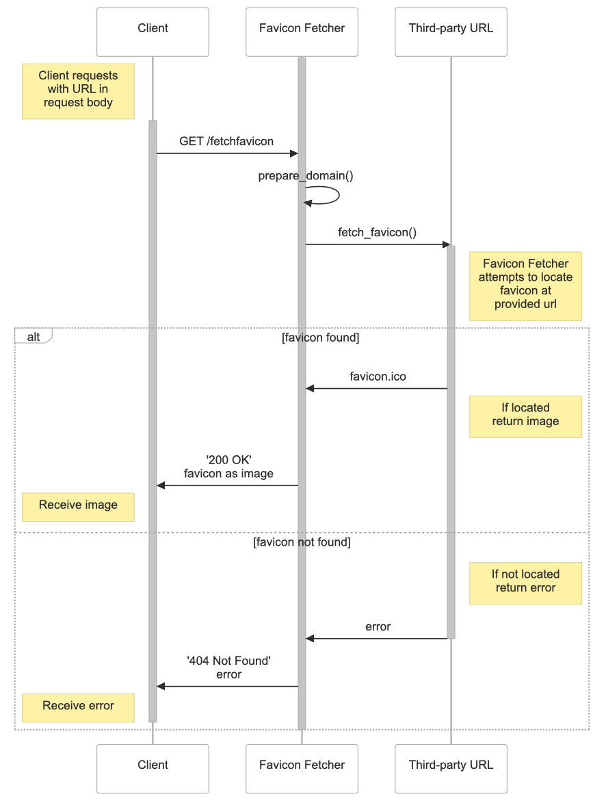

# README #
Favicon Fetcher is a very simple fastapi app that with a single route. The app accepts GET requests at that route with a request body that specifies a url. The app attempts to retrieve the favicon from that url. If successful, the app returns the favicon as a response to the initial request. If unsuccessful, the app supplies appropriate error messages.

All application logic is contained within the `__init__.py` file within the `WrapperFunction` directory.

Most of the other files in this repo support deployment to Azure functions.


## Request ##
The app is currently deployed to a publically available Azure Function with no authentication. It is available at the base url: `https://favicon-fetcher.azurewebsites.net`

There is a single route, `/fetchfavicon/` that supports a GET request. Requestors must include a JSON request body that contains a single attribute, `url` with the url of the website to fetch the favicon from as a string as the value.

```
{"url": "www.example.net"}
```
### Example call with curl ###

```
curl --request GET 'https://favicon-fetcher.azurewebsites.net/fetchfavicon/' \
--header 'Content-Type: application/json' \
--data '{"url": "https://poncho.com"}'
```

## Response ##
Successful responses are binary streams that requestors must interpret as images per the included `media_type="image/png"` response header. They return with an http status code of `200 OK`.

Unsuccessful responses return appropriate status codes based on the error condition.
* Malformed requests return http status code `422 Unprocessable Entity`
* Well formed requests where the favicon cannot be located return http status code `404 Not Found` 

### Example response from example call above ###
Here's the favicon from `https://poncho.com` as returned from the example call above: <br><br>


Here are the response headers from the same example call:
```
{
    'Content-Length': '15086', 
    'Content-Type': 'image/png', 
    'Date': 'Fri, 15 Nov 2024 00:29:14 GMT', 
    'Server': 'Kestrel', 
    'Request-Context': 'appId=cid-v1:e1bd17f8-3916-437b-9417-fdc2f3b4418a'
}
```

## UML Sequence Diagram ##


## Run Azure Function Locally for Debugging ##
1. Install Azure Functions VS Code Extension
1. Create and activate python3.11 venv
1. Install requirements from requirements.txt <br>
    `pip install -r requirements.txt`
1. Select debug and run, output will provide local urls for testing
1. Saved changes to `function_app.py` or `WrapperFunction/__init__.py` will be detected by the server and automatically reloaded.